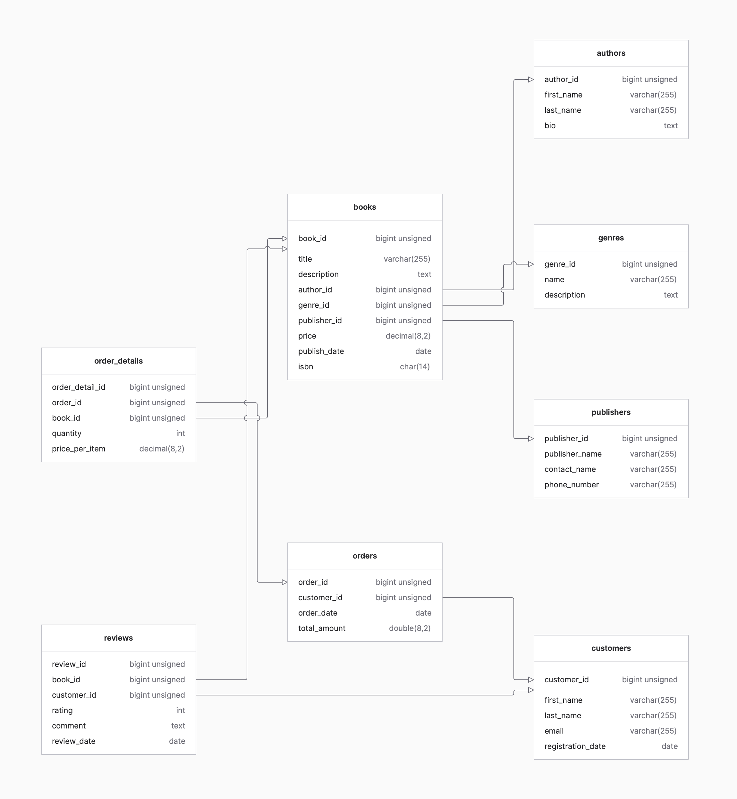

# REST API Crud

#### Basic Backend using Express, Prisma ORM, TpeScript and Postgres database

## Create the project

- Install Node (if you have't already). For this project I'm currently using v20.12.1 LST.
- Create an empty postgres database. The db I'm using is called `rest-api-crud`.
- Create the folder and initialize npm with `npm init -y`.
- Add git remote to the GithHub repository for the project.
- Install `express` dependency (node framework).
- Install the devDependencies: `prisma`, `typescript`, `nodemon`, `ts-node`, `@types/node` and `@types/express`.
  - Prisma: the ORM (Object–relational mapping).
  - Nodemon: to monitor for changes in the server and restart automatically.
  - TS-Node: TypeScript execution engine and REPL for Node.js.
  - @Types/Node and @Types-Express: TypeScript types definitions.
- Create `tsconfig.json` file with default configurations:
  ```
  {
  "compilerOptions": {
    "sourceMap": true,
    "outDir": "dist",
    "strict": true,
    "lib": ["esnext"],
    "esModuleInterop": true,
    }
  }
  ```
- Add scripts for:
  - Development: `"dev": "nodemon src/index.ts"`.
  - Production: `"build": "npx tsc"`. This script creates a transpiled JavaScript build in the folder `/dist`.
  - To execute production build: `"start": "node dist/index.ts"`.
- Initialize Prisma using `npx prisma init --datasource-provider postgresql`. This creates `/prisma` folder with the schema configured for Postgres and `.env` file for enviroment variables.
- Add postgres user, password and database name in `DATABASE_URL` inside `.env` file.

## Enviroment Variables

I'm using `dotenvx` dependecy to handle the enviroment variables for development `.env.development` and production `.env.production`.
In order to combine variables using dotenvx I changed the dev script to: `dotenvx run --env-file=.env.development --env-file=.env -- nodemon api/app.ts`.
And the production script to: `dotenvx run --env-file=.env.development --env-file=.env -- npx tsc`.

## Database Schema

The schema for the database is for an online bookstore.

The models for the tables and their relations were made with Prisma.

## ToDo

- Prisma models
- json files fake data and seeds
- Routes
- Controllers
- Services
- Testing
