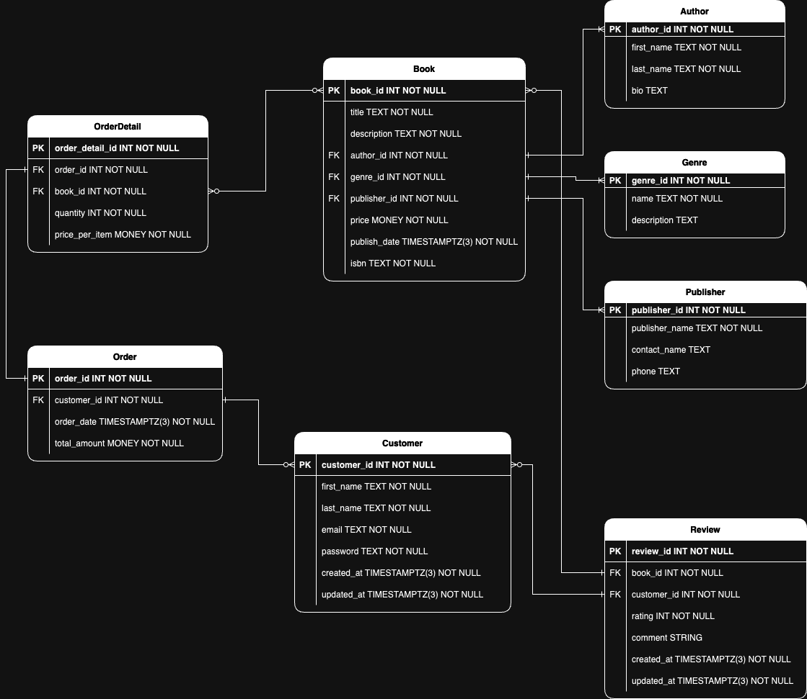

# REST API Crud

#### Basic Backend using Express, Prisma ORM, TpeScript and Postgres database

---

## Start the project

- After clonning this repository run from root folder `npm i`.
- Create a postgres db named `rest-api-crud`.
- Push the schema and seeds with `npm run seed`.
- Start the local server with `npm run dev`.

## Project creation

- Install Node (if you have't already). For this project I'm currently using v20.12.1 LST.
- Create an empty postgres database. The db I'm using is called `rest-api-crud`.
- Create the folder and initialize npm with `npm init -y`.
- Add git remote to the GithHub repository for the project.
- Install `express` dependency (node framework).
- Install the devDependencies: `prisma`, `typescript`, `nodemon`, `ts-node`, `@types/node` and `@types/express`.
  - Prisma: the ORM (Object–relational mapping).
  - Nodemon: to monitor for changes in the server and restart automatically.
  - TS-Node: TypeScript execution engine and REPL for Node.js.
  - @Types/Node and @Types-Express: TypeScript types definitions.
- Create `tsconfig.json` file with default configurations:
  ```
  {
  "compilerOptions": {
    "sourceMap": true,
    "outDir": "dist",
    "strict": true,
    "lib": ["esnext"],
    "esModuleInterop": true,
    }
  }
  ```
- Add scripts for:
  - Development: `"dev": "nodemon src/index.ts"`.
  - Production: `"build": "npx tsc"`. This script creates a transpiled JavaScript build in the folder `/dist`.
  - To execute production build: `"start": "node dist/index.ts"`.
- Initialize Prisma using `npx prisma init --datasource-provider postgresql`. This creates `/prisma` folder with the schema configured for Postgres and `.env` file for enviroment variables.
- Add postgres user, password and database name in `DATABASE_URL` inside `.env` file.

## Enviroment Variables

I'm using `dotenvx` dependecy to handle the enviroment variables for development `.env.development` and production `.env.production`.
In order to combine variables using dotenvx I changed the dev script to: `dotenvx run --env-file=.env.development --env-file=.env -- nodemon api/app.ts`.
And the production script to: `dotenvx run --env-file=.env.development --env-file=.env -- npx tsc`.

## Database Schema

This is the original ERD schema for an online bookstore database.


I created a new ERD using `draw.io` with some changes in relations and data types taking advantage of some unique postgres features and good practices.



For example, all the string values are `TEXT` fiels (postgres recommends against char or varchar with param because it uses more db space), for money values I'm using the `MONEY` field and for dates `TMESTAMPTZ`.

To delete an item with reations (e.g., Books can have many Reviews) the relation params for the model needs to include `onDelete: Cascade`. Following the Books example, if a book is deleted all the related reviews will also be deleted.

## Database creation

Following prisma's documentation I created an empty postgres db with the name `rest_api_crud`. I'm using **Postgress.app** to create and execute postgres db's and **Postico** for tables visualization and editing.

For migration I used `npx prisma migrate dev --name init`.
This migrates the models to the db and creates a folder in `/prisma/migrations` with a migration file with the given name (in this case "init").
If not previously installed, the script will install `prisma-client-js` generator to connect to the db.

> The script for production and testing migrations is `npx prisma migrate deploy`. But is only recommended for automated CI/CD pipelines.

## Seeds

I used Mockaroo (https://www.mockaroo.com/) to create fake data .
The files are located in `/prisma/seedData` named `.seed.ts`.
I'm using objects (not `json`) to avoid the conversion process.
Because the dates have an incorrect format I'm mapping the arrays to replace them to ISO format.

To aviod conflicts with the relations between models I created a function that execute `Promise.all` applying "upsert" for every object.
This solves the issue of duplicate data and allows the seeds to be applied multiple times.

> The `Promise.all` for seeding the models in the `runSeeders()` function must respect this order:
>
> 1. Models without relations declaration.
> 2. Models with relations to previous models.
>
> This happens because the seeds store false ids. If the second model tries to make a relation to a non-existent id it will return an error.

To run the seeds in the db use the script `npm run seed`. It executes "prima db push" (forces db schema) combined with `prisma/seed.ts`.

## Routes

The routes for the models are located in `/api/routes`. I used an `index.ts` file to simplify the import of the routes in the server.

## Error handling

The middleware `globalErrorHandler` prevents repetition and consistency in error handling.
The class `CustomError` extends default Error adding status and mesage values.
The middleware uses the class to recieve the errors.
The controllers use the function `errorHandler` passing the params status and message. The function creates a new error extendend by `CustomError`.
The wild card middleware that catches all the non existing routes pass the errors to `globalErrorHandler` with status 404s.
The middleware `notFoundHandler` catches all the incorrect routes and returns status `404` with the recieved route and error message. The error passes to `globalErrorHandler`.

## Send Files for book covers

The endpoint `/api/image/:id` returns book cover images in jpg format using the id for the book.
It aslo includes error handling for the `res.sendFile` method when the Id is incorrect or the book cover does't exist.

## Pagination and Sorting

The pagination uses Offset pagination that requires two values: `take` (number of items per page) and `skip` (the amount of items to offset on the list).
The skip value is the page number multiplied by the page number. The result must be an integer using `Math.floor`.
OrderBy receives the sort (column name) and type of order (`asc` or `desc`).

## Categories list

The `category` endpoints returns lists of models and categories (models column names).
The lists are intended to be used by the client side for dropdowns or filter's options.
For example, to filter books by `author`, `title`, etc.
Because the columns for the tables can change over time, the lists will always allow the frontend to use faithful and up to date data.

## Validation

The data recieved in the body for `POST` and `PATCH` endpoints is validated using `express-validator`. The dependency works as a middleware before the controllers for the routes. The configuration files are stored un the route `/api/validators`.

## Filtering

For filtering the controllers uses two query params: `filterkey` and `filterval` (optional params).
Filterkey is the element to filter the list.
Filterval is the string to filter based on the filterkey value.
The filter works in conjunction with pagination and sorting (orderBy).
Prisma uses `where` to apply the filters.
Because the ammount of elemets using `where` are different from the unfiltered list, the controllers use a filterHandler to pass the "where" object to `count` and `findMany`.

## Cors

The dependency `cors` (along with `@types/cors` as devDependency) enables cors to comunicate with a frontend running with a different port.
The file `api/config/corsOptions.ts` specify the allowed origins to interact with the api.
Without an options file as parameter, cors will be enabled for all origins.

## Logger

The projet uses `morgan` (and `@types/morgan` as devDependency) http logger in "dev" mode (reduced details) for development and "common" for production (shows mor details).

## ToDo

- Controllers:

  - Define Order and OrderDetails relations

  - Order:
    - getAll w/sort and customer, order_date (range) filter, getByid, post, patchByid, deleteById
  - OrderDetail:

    - getAll w/sort and filter (book, define filters), getByid, post, patchByid, deleteById

  - Refactor filters logic
    - Add dates and other values range search
    - change "filter" to key name for unique filter values

- Customer login and session (bcrypt password)
- Customer (and admin?) session with JWT
- Testing
- Swagger
- Export db to `.CSV`
- docker
