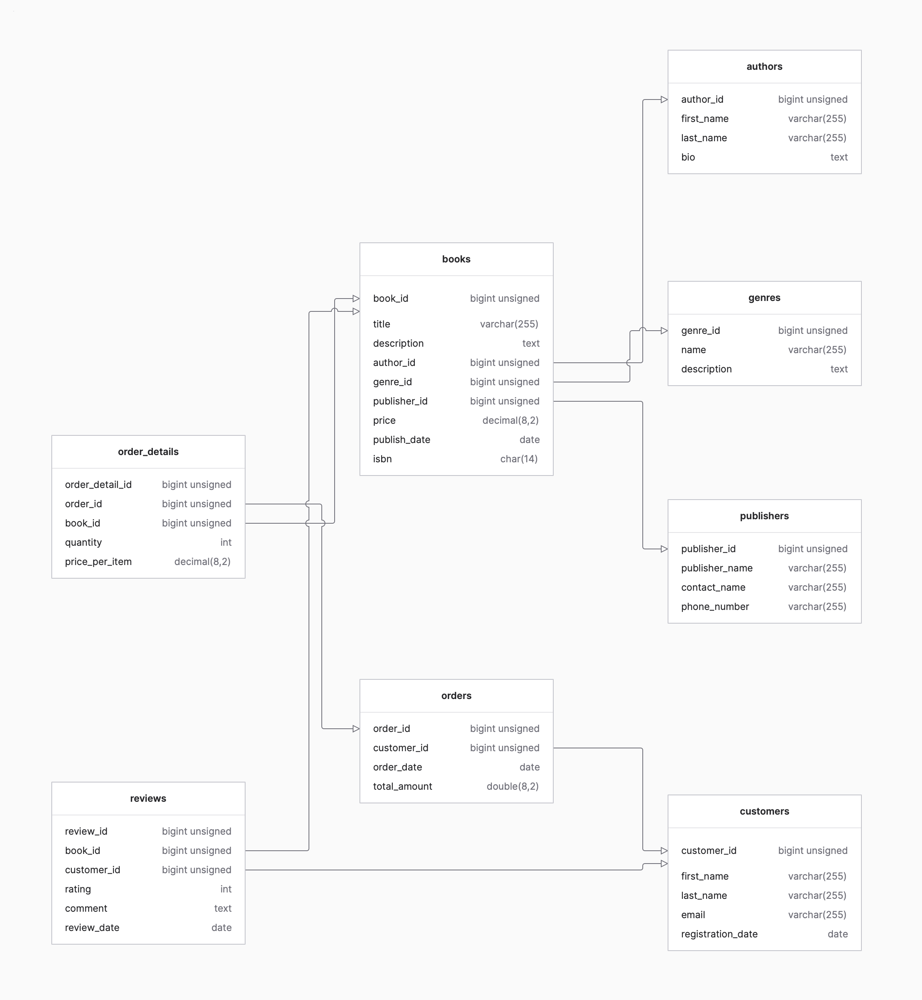
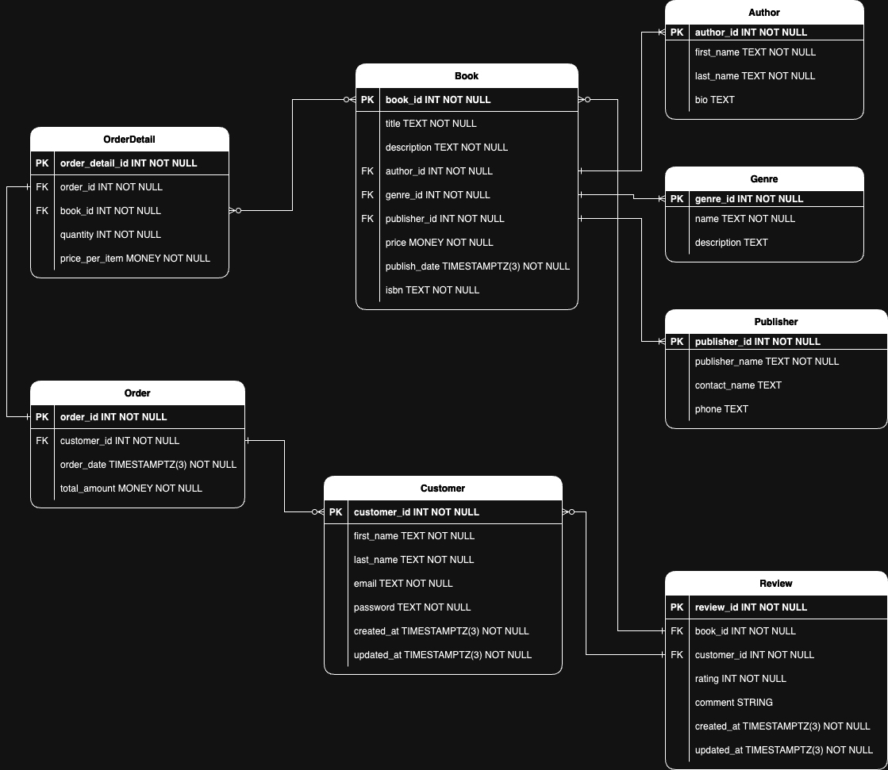

# REST API CRUD

#### Backend using Express, Prisma ORM, TypeScript, and PostgreSQL database.

---

## Quick Start

1. Clone the repository
2. Use **Node.js 22+** (`engines.node` requires `>=22.0.0`) and run `pnpm install` from the root folder
3. Copy [`.envexample`](.envexample) into `.env`, `.env.development`, and (optionally) `.env.production` / `.env.test`, then fill in the values
4. Create a PostgreSQL database and set `DATABASE_URL` in `.env`
5. Start Redis locally (`redis-server`) or via Docker
6. Run `pnpm run seed` to push the schema and seed the database
7. Start the local server with `pnpm run dev`

## Requirements

- **Node.js** `>=22.0.0`
- **pnpm** (package manager)
- **PostgreSQL**
- **Redis** (caching, sessions, and rate limiting)

## Scripts

| Script | Description |
| --- | --- |
| `pnpm run dev` | Run the API with `tsx` and load `.env.development` + `.env` |
| `pnpm run build` | Compile TypeScript with `tsc` into `/dist` |
| `pnpm start` | Run the compiled production build with `.env.production` + `.env` |
| `pnpm run seed` | Push the schema (`prisma db push`) and run [prisma/seed.ts](prisma/seed.ts) via `ts-node` |
| `pnpm run export:csv` | Run [prisma/exportCSV.ts](prisma/exportCSV.ts) via `ts-node` |
| `pnpm test` | Apply migrations with test env, then run all `api/**/*.test.ts` tests |
| `pnpm test:run` | Run tests without migrating (env vars must already be loaded) |
| `pnpm test:watch` | Re-run tests on file changes |
| `pnpm lint` / `pnpm lint:fix` | ESLint check / auto-fix |
| `pnpm format` / `pnpm format:check` | Prettier write / check |
| `pnpm run docker:up-dev` | Start the development Docker Compose stack |
| `pnpm run docker:up-prod` | Start the production Docker Compose stack |

TypeScript execution:

- **`tsx`**: development server and tests (`node:test` via `tsx --test`)
- **`ts-node`**: Prisma seed and CSV export scripts
- **`tsc` + `node`**: production build and start

## Key Features

- **Environment Variables**: Uses Node's built-in `--env-file` loading (v20.6+)
- **Database Schema**: Optimized ERD for an online bookstore
- **Prisma ORM**: Migrations, seeding, and Postgres driver adapter (`@prisma/adapter-pg`)
- **Prisma v7 Ready**: Uses `prisma.config.ts` for datasource configuration and a generated client under [prisma/generated/prisma](prisma/generated/prisma)
- **API Routes**: Organized in `/api/routes`
- **Error Handling**: Global error handler and custom error class
- **File Serving**: Endpoint for serving book cover images
- **Pagination and Sorting**: Implemented for list endpoints
- **Data Validation**: Using `express-validator` middleware
- **Filtering**: Prisma-based filtering for queries
- **CORS**: Configured for cross-origin requests
- **Logging**: HTTP logging with Morgan
- **Caching**: Redis-based caching for improved performance
- **Authentication**:
  - Password hashing with bcrypt
  - JWT-based authentication with access and refresh tokens
- **Rate Limiting**: Prevents brute force attacks on login
- **API Documentation**: Swagger UI available at `/docs`
- **Testing**: Node.js native test runner (`node:test`), `tsx`, and Supertest
- **Code Quality**: ESLint for linting and Prettier for formatting
- **Docker**: Development and production Compose stacks

## Prisma v7 Upgrade

Prisma v7 introduces a new configuration file and some behavioral changes:

- **Datasource configuration moved**: `datasource.url` now lives in [prisma.config.ts](prisma.config.ts), not in [prisma/schema.prisma](prisma/schema.prisma).
  - See our config in [prisma.config.ts](prisma.config.ts). It sets `datasource.url` using `env('DATABASE_URL')` and loads `.env` via `import 'dotenv/config'`.
  - The `datasource` block in [prisma/schema.prisma](prisma/schema.prisma) no longer contains a `url` property.
- **Generated client import path**: Import `PrismaClient` and `Prisma` types from the generated output at [prisma/generated/prisma](prisma/generated/prisma). In ESM, import explicitly from [prisma/generated/prisma/index.js](prisma/generated/prisma/index.js).
  - Example usage: see [api/config/prismaClient.ts](api/config/prismaClient.ts).
  - Middleware using Prisma types (e.g., `Prisma.PrismaClientKnownRequestError`) should also import from [prisma/generated/prisma](prisma/generated/prisma), as in [api/middleware/errorHandler.middleware.ts](api/middleware/errorHandler.middleware.ts).
- **Driver adapter (JS engine)**: If your generated client uses the JS engine (`client.js` present), provide a driver adapter or Accelerate URL. This project uses `@prisma/adapter-pg`:
  - See adapter setup in [api/config/prismaClient.ts](api/config/prismaClient.ts).
  - Ensure `DATABASE_URL` is available to the app (we load `.env` via `import 'dotenv/config'`).
- **Generate**: `pnpm prisma generate` now reads [prisma.config.ts](prisma.config.ts) automatically and generates the client to [prisma/generated/prisma](prisma/generated/prisma).
- **Migrations**: `pnpm prisma migrate dev` and `pnpm prisma migrate deploy` continue to work.
- **Seeding change**: In v7, seeding only runs when invoked explicitly via `pnpm prisma db seed`. Our project keeps an app-specific seed script (`pnpm run seed`) that first pushes the schema and then runs [prisma/seed.ts](prisma/seed.ts).

Common commands:

```bash
# Generate Prisma Client
pnpm prisma generate

# Validate schema and config
pnpm prisma validate

# Apply development migrations
pnpm prisma migrate dev --name init

# Apply production/testing migrations
pnpm prisma migrate deploy

# Seed via Prisma CLI (optional alternative)
pnpm prisma db seed
```

## Database Schema

This is the original ERD schema for an online bookstore database.



A new ERD using `draw.io` with some changes in relations and data types was created taking advantage of some unique postgres features.



For example, all the string values are `TEXT` fields (postgres recommends against char or varchar with param because it uses more db space), for money values `MONEY` field and dates `TIMESTAMPTZ`.

To delete an item with relations (e.g., Books can have many Reviews) the relation params for the model need to include `onDelete: Cascade`.
Following the Books example, if a book is deleted all the related reviews will also be deleted.

## Database creation

Create an empty PostgreSQL database and set `DATABASE_URL` in `.env` (see [`.envexample`](.envexample)).
For tests, [`.env.test`](.env.test) points at a separate database (for example `test_api_crud`).
In macOS, **Postgres.app** can run Postgres locally and **Postico** is useful for table visualization as an alternative to pgcli.

Migrate the models to the db with `pnpm prisma migrate dev --name init`.
This creates a new folder `/prisma/migrations` with a migration file with the name used at the end of the script (in this case "init").
With Prisma v7, the client is generated to [prisma/generated/prisma](prisma/generated/prisma) and the CLI reads the datasource URL from [prisma.config.ts](prisma.config.ts). For Postgres with the JS engine, the app config includes the `@prisma/adapter-pg` setup.

> The script for production and testing migrations is `pnpm prisma migrate deploy`. It is mainly intended for automated CI/CD pipelines (and is also used by `pnpm test`).

## Seeds

Mockaroo (https://www.mockaroo.com/) is a tool to create fake data for db seeding in different formats (json, object, CSV, etc).
The mocks used are objects (not json) to avoid the conversion process.
The files are located in `/prisma/seedData`.

> Because the dates have an incorrect format I'm mapping the arrays to replace them to ISO format.

To avoid relation conflicts between model seeds, the function executes `Promise.all` applying "upsert" for every object.
This solves the issue of duplicate data and allows the seeds to be applied multiple times without errors.

> The `Promise.all` for seeding the models in the `runSeeders()` function must respect this order:
>
> 1. Models without relations declaration.
> 2. Models with relations to previous models.
>
> This happens because the seed stores false Ids. And if the second model tries to make a relation to a non-existent Id it will return an error.

The script `pnpm run seed` finds or creates the db and populates the db with the seeds executing `prisma db push` (forces db schema) combined with [prisma/seed.ts](prisma/seed.ts).
Note: Prisma v7 doesn't auto-run seeds during `migrate dev` or `reset`. To seed via the CLI, use `pnpm prisma db seed`.

## Linter and Formatter

`ESLint` is used for linting and `Prettier` for formatting.
Configuration lives in `eslint.config.js` and `.prettierrc.json`.

```bash
pnpm lint          # check for lint issues
pnpm lint:fix     # auto-fix lint issues
pnpm format        # format all files
pnpm format:check  # check formatting without writing
```

## Routes

The routes for the models are located in `/api/routes`.
The file `index.ts` combines all the routes import for simpler export to the server.

## Error handling

The middleware `globalErrorHandler` prevents repetition and gives consistency in error handling.
The class `CustomError` extends the default Error adding status and message values.
The middleware uses the class to receive the errors.
The controllers use the function `errorHandler` passing the params status and message. The function creates a new error extended by `CustomError`.

The middleware `notFoundHandler` catches all incorrect routes and returns status `404` with the received route and error message. The error is passed to `globalErrorHandler`.

## Send book cover image files

The endpoint `/api/image/:id` returns book cover images in jpg format using the id for the book.
It also includes error handling for the `res.sendFile` method when the Id is incorrect or the book cover doesn't exist.

## Pagination and Sorting

The pagination uses Offset pagination that requires two values: `take` (number of items per page) and `skip` (the number of items to offset on the list).
The skip value is the page number multiplied by the page size. The result must be an integer using `Math.floor`.
OrderBy receives the sort (column name) and type of order (`asc` or `desc`).

## Categories list

The `category` endpoints return lists of models and categories (models column names).
The lists are intended to be used by the client side for dropdowns or filter options.
For example, to filter books by `author`, `title`, etc.
Because the columns for the tables can change over time, the lists will always allow the frontend to use faithful and up-to-date data.

## Params Validation

The data received in the endpoints by query and body is validated using `express-validator`.
The dependency works as a middleware before the controllers for the routes.
The configuration files are stored in `/api/validators` with the same names as the controllers.

## Filtering

Prisma uses a `where` object to apply the filters.
The filter works in conjunction with pagination and sorting (orderBy).
Some of the filters are optional and only passed to the `where` object if the query param exist.
Because the amount of elements using `where` are different from the unfiltered list, the controllers pass the "where" object to `count` and `findMany`.

## Orders and OrderDetails

The OrderDetails (specifies the book, quantity and price per item) are always related to an Order.
Because of this relation, only by creating a new Order the OrderDetails are added.

## Cors

The dependency `cors` (along with `@types/cors` as devDependency) enables cors to communicate with a frontend running with a different port.
The file `api/config/corsOptions.ts` specifies the allowed origins to interact with the api.
Without an options file as parameter, cors will be enabled for all origins.

## Logger

The project uses `morgan` (and `@types/morgan` as devDependency) http logger in "dev" mode (reduced details) for development and "common" for production (more details).

## Redis

The project uses Redis for memory data storage allowing faster responses.
To start the redis server (after installing Redis locally) run `redis-server` on the terminal.
The app DBngin is an alternative for executing redis locally.
The redis server can be stopped using `ctrl-c` or `redis-cli shutdown`.
The redis singleton client [`api/config/redisClient.ts`](api/config/redisClient.ts) logs by console the connection status.
For monitor and manipulate the keys stored in Redis use `Redis Insight`.
The dependency `ioredis` is used to interact with Redis from Node.
The Redis uses are:

### Cache

Redis is used as cache for lists controllers to improve speed and prevent overloads in the db.
The endpoints using redis returns a value `cache` (boolean).

> This value is not necessary, but useful to identify the responses from db or cache.

If the controller finds a cache key for the specific request will return the cached values.
If no cache is found the controller calls the db, stores in cache the result and then returns them.
The additional params "EX" (for seconds, or "PX" for milliseconds) and the number of seconds adds expiration to the cached keys.
When the cache expires it removes itself from redis.
The services to create, modify and delete elements removes all the existing cached keys for the related lists.

### User session

See [JWT Access and Refresh](#jwt-access-and-refresh)

### Rate Limiter

See [Rate Limiter](#rate-limiter)

## Password hash and salt

New users passwords are encrypted using `bcrypt` hash and salt.
Bcrypt hashes the password and adds salt to avoid rainbow table attacks.
The password is stored in db hashed and is only known by the user.
If the user forgets or needs to change the password a new password must be entered.
Bcrypt verify the passwords at login by encrypting and comparing the received and stored password (the hash and salt must be equal).
The hashed password never gets decrypted by Bcrypt.

## Rate Limiter

The middleware `rateLimiter.middleware.ts` prevents from brute force attacks in the `/customer/login` endpoint storing the user Ip and the user email in Redis with the number of failed attempts and the TTL (time to live) for the Redis key.
If the user exceeds the amount of failed requests permitted, the middleware returns status 429 (Too many requests) and changes the TTL for the Redis key to the block duration specified in the env variable blocking the user access.

A second rate limiter middleware `rateLimiterFlexible.middleware.ts` using `rate-limiter-flexible` can be found in the project.
It also stores in Redis with the same results as `rateLimiter.middleware.ts`.
The only difference is the `insuranceLimiter` configuration allowing to continue processing requests in memory if Redis fails.
This middleware is not used in the project but is kept as a possible backup and for configuration reference.

## JWT Access and Refresh

When the user successfully login, the server returns two JWT (JSON Web Token) in http only cookies: `access_token` and `refresh_token`.
This allows for stateless user sessions and permissions (client side).
The cookies prevent the JWT from being javascript accessible from the client side.
Only the signatures for the jwt and the cookies are encrypted, not the tokens content.

- The `access_token` informs the server if the user have access to the resources. The token and the cookie are short-lived to prevent signature forgery and other types of attacks.
  When the token gets invalidated or the cookie expires, if the `refresh_token` is valid, a new `access_token` is generated.
- The `refresh_token` validation is longer and gives the user session on the client side.
  As long the `refresh_token` is valid, a new `access_token` is generated allowing the user to access the permitted resources.

## Export to CSV

To export a table to CSV file use the SQL query in `/scripts/exportToCSV.sql` replacing the table name, path and name for the `.csv` file.
There is also an app script: `pnpm run export:csv`.

## Swagger documentation

The list of endpoints is documented with Swagger in `http://localhost:8080/docs`.
The endpoints are ordered by types and include params, query params and body.
All the responses show status code and examples.

## Testing

The routes (E2E) and middleware are tested using Node's built-in test runner (`node:test`) and `supertest`.
TypeScript tests are executed with `tsx` (`tsx --test`).
`ioredis-mock` is used to mock Redis in the testing environment.

```bash
pnpm test          # migrate test DB, then run all *.test.ts files
pnpm test:watch    # re-run tests on file changes
pnpm test:run      # run tests without migrating (requires env vars loaded)
```

Tests live in `api/**/__tests__/*.test.ts`. Assertions use `node:assert/strict`; spies use `mock.fn()` from `node:test`.
Use helpers from [`api/__mocks__/testFixtures.ts`](api/__mocks__/testFixtures.ts) (`uniqueCustomer`, `uniqueAuthor`, `createAuthenticatedAgent`, `createBookGraph`) for DB-backed E2E tests.
Route E2E coverage includes auth (`customerSession`), category, author, genre, publisher, book, customer, order, review, and image.
Middleware unit tests cover `verifyJWT`, `validationError`, `notFound`, `globalErrorHandler`, and `rateLimiter`.
Utility tests live in `api/utils/__tests__/`.
Validator unit tests live in `api/validators/__tests__/`.

## Docker

Development and production Compose files are included:

```bash
pnpm run docker:build-dev
pnpm run docker:up-dev
pnpm run docker:down-dev

pnpm run docker:build-prod
pnpm run docker:up-prod
pnpm run docker:down-prod
```

The Compose stacks start Postgres, Redis, and the API. Configure `POSTGRES_USER`, `POSTGRES_PASSWORD`, and `POSTGRES_DB` along with the app env files before starting.
